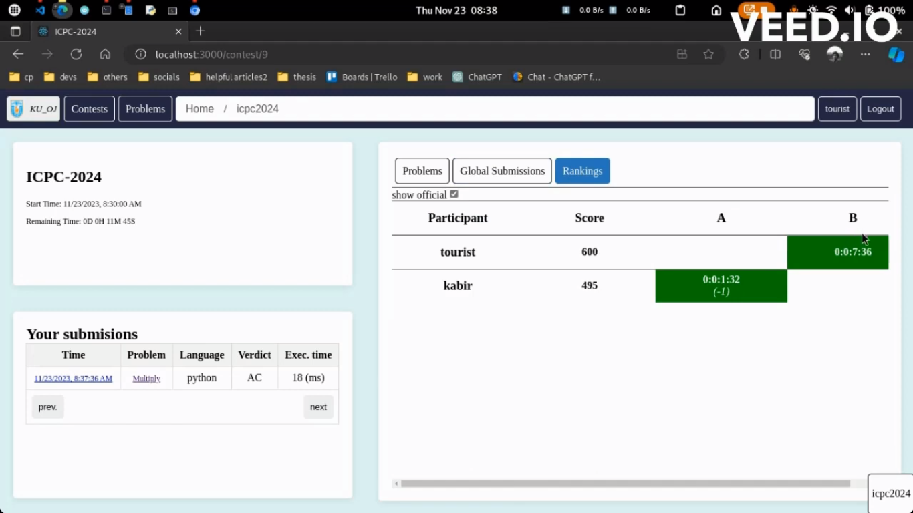
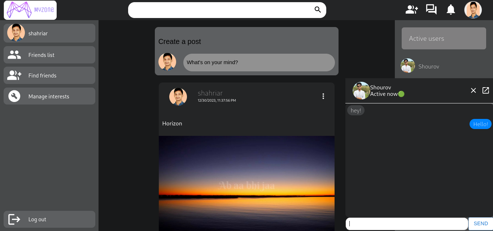
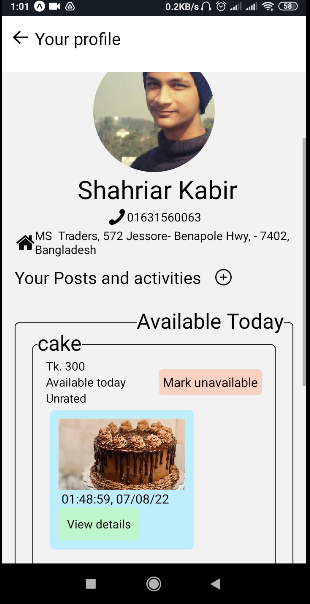
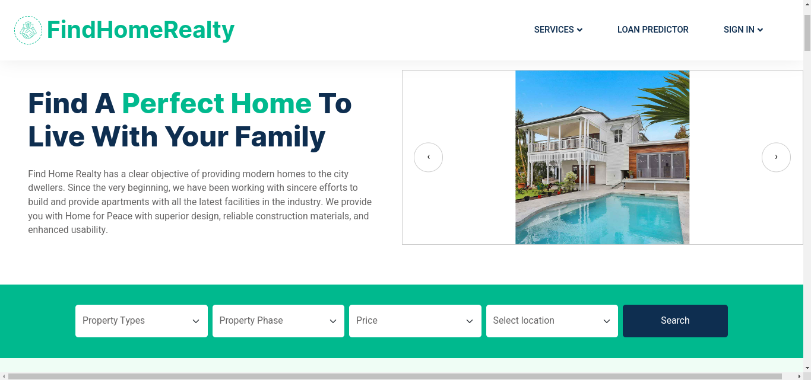
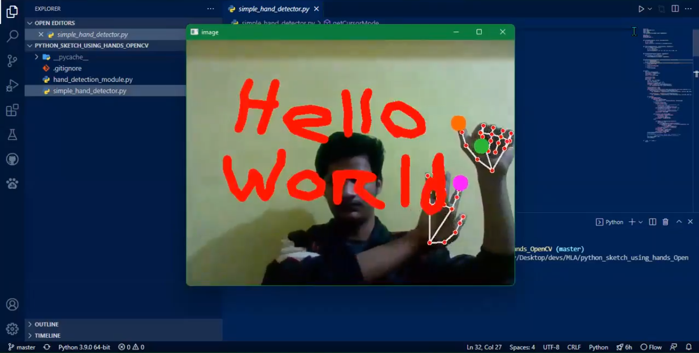

Hi My name is
Md. Shahriar Kabir
==========================================================================================================================================

Web Developer
-------------

Node.JS is 💖  
React is 💖  
So is coding.  
And so is staying up late and building up the dream projects!  
And so is problem-solving!

* 🌍  I'm based in Bangladesh
* ✉️  You can contact me at [shourovk6@gmail.com](mailto:shourovk6@gmail.com)
* 🧠  I'm learning Django
* 🤝  I'm open to collaborating on Any NodeJS-powered project.
* ⚡  If you love Family Guy, we must be friends!

### Skills

    

### Socials

 <a href="https://discord.com/users/shahriar0639" target="_blank" rel="noreferrer">
        <picture>
            <source media="(prefers-color-scheme: light)" srcset="undefined" />
            <source media="(prefers-color-scheme: light)"
                srcset="https://raw.githubusercontent.com/danielcranney/readme-generator/main/public/icons/socials/discord.svg" />
            
        </picture>
    </a> <a href="https://www.github.com/shahriarKabir44" target="_blank" rel="noreferrer">
        <picture>
            <source media="(prefers-color-scheme: dark)"
                srcset="https://raw.githubusercontent.com/danielcranney/readme-generator/main/public/icons/socials/github-dark.svg" />
            <source media="(prefers-color-scheme: light)"
                srcset="https://raw.githubusercontent.com/danielcranney/readme-generator/main/public/icons/socials/github.svg" />
            
        </picture>
    </a> <a href="https://www.linkedin.com/in/shahriar-kabir-2234941b3/" target="_blank" rel="noreferrer">
        <picture>
            <source media="(prefers-color-scheme: dark)"
                srcset="https://raw.githubusercontent.com/danielcranney/readme-generator/main/public/icons/socials/linkedin-dark.svg" />
            <source media="(prefers-color-scheme: light)"
                srcset="https://raw.githubusercontent.com/danielcranney/readme-generator/main/public/icons/socials/linkedin.svg" />
            
        </picture>
    </a>

### Badges

<b>My GitHub Stats</b>

## Competitive Programming:
<ul>
    <li>Stopstalk Handle: <a href="https://www.stopstalk.com/user/profile/programeme">/programeme</a></li>
    <li>Codeforces max rating: 1445</li>
    <li>CodeChef max rating: 1783</li>
</ul>

## Projects

### Tools 🛠:

    

        
        

            <h2 class="projectTitle">Migratify</h2>
            

                <a href="https://github.com/shahriarKabir44/migratify">GitHub</a>
                <a href="https://www.npmjs.com/package/migratify">NPMjs</a>
            

        

        <h4 class="projectType">A database migration CLI tool.</h4>
        <h3>Features:</h3>
        <ol>
            <li>Create and update database schema programmatically.</li>
            <li>Create migration files from an existing database.</li>
            <li>Rollback the last migration.</li>
            <li>Dump Schema and/or data</li>
        </ol>
        <h3>Technologies:</h3>
        <ol class="technologies">
            <li>MySQL</li>
            <li>NodeJS</li>
        </ol>
    

### Web Projects 🌐:

    

        
        

            <h2 class="projectTitle">KU_OJ</h2>
            

                <a href="https://github.com/shahriarKabir44/ku_oj">GitHub</a>
                <a href="https://youtu.be/29oM96NiW58">YouTube</a>
                <a href="ku-oj.vercel.app">Live link</a>
            

        

        <h4 class="projectType">A Competitive Programming Platrorm for Khulna University</h4>
        <h3>Features:</h3>
        <ol>
            <li>Create and host programming contests.</li>
            <li>Users can submit solutions in Python, C/C++ and Java.</li>
            <li>Real time texting during contests.</li>
            <li>Contest hosts can update testcases and it will rejudge all the submissions.</li>
            <li>Official and unofficial scoreboards</li>
        </ol>
        <h3>Technologies:</h3>
        <ol class="technologies">
            <li>MySQL</li>
            <li>NodeJS</li>
            <li>React</li>
            <li>Expressjs</li>
            <li>Redis</li>
            <li>WebSocket</li>
        </ol>
    

    

        
        

            <h2 class="projectTitle">My Zone</h2>
            

                <a href="https://github.com/shahriarKabir44/myzone">GitHub</a>
                <a href="myzone-omega.vercel.app">Live Link</a>
            

        

        <h4 class="projectType">A social media platform.</h4>
        <h3>Features:</h3>
        <ol>
            <li>Create and update posts.</li>
            <li>Realtime user interactions via messaging, post interactions and friend request.</li>
            <li>Find users with common interests and friends.</li>
            <li>Feature photos in profile in albums.</li>
        </ol>
        <h3>Technologies:</h3>
        <ol class="technologies">
            <li>MySQL</li>
            <li>Expressjs</li>
            <li>NodeJS</li>
            <li>React</li>
            <li>WebSocket</li>
            <li>Redux</li>
            <li>GraphQL</li>
        </ol>
    

### Androind Projects 📱:

    

        

            <h2 class="projectTitle">Oregano</h2>
            

                <a href="https://github.com/shahriarKabir44/oregano">GitHub</a>
            

        

        

            
            

                <h4 class="projectType">A food delivery platform.</h4>
                <h3>Features:</h3>
                <ol>
                    <li>Buy and sell food items.</li>
                    <li>Usage of Google maps to get locations.</li>
                    <li>Push notifications.</li>
                    <li>Anyone can be a buyer, seller and a rider.</li>
                    <li>Web view for admin to track and assign riders.</li>
                </ol>
                <h3>Technologies:</h3>
                <ol class="technologies">
                    <li>MongoDB</li>
                    <li>Expressjs</li>
                    <li>NodeJS</li>
                    <li>React Native Expo</li>
                    <li>Angularjs</li>
                    <li>Service worker</li>
                    <li>GraphQL</li>
                </ol>
            

        

    

### Machine Learning 🤖:

    

        
        

            <h2 class="projectTitle">FindHome</h2>
            

                <a href="https://github.com/shahriarKabir44/findHome">GitHub</a>
            

        

        <h4 class="projectType">A property buying and selling platform.</h4>
        <h3>Features:</h3>
        <ol>
            <li>Admins can register or restrict companies.</li>
            <li>Companies can post about properties.</li>
            <li>Users can bid for properties.</li>
            <li>Users can check whether they are eligible for loan using Machine Learning.</li>
            <li>Random Forest classifier gives 76% accuracy.</li>
        </ol>
        <h3>Technologies:</h3>
        <ol class="technologies">
            <li>MySQL</li>
            <li>NodeJS</li>
            <li>Angularjs</li>
            <li>Expressjs</li>
            <li>Scikit-Learn</li>
            <li>Python</li>
        </ol>
    

    

        
        

            <h2 class="projectTitle">Etch A Sketch</h2>
            

                <a href="https://github.com/shahriarKabir44/etch_a_sketch">GitHub</a>
                <a href="https://www.linkedin.com/in/shahriar-kabir-2234941b3/recent-activity/all/">Video
                    Demonstration</a>
            

        

        <h4 class="projectType">A drawing tool that detects finger positions and plots points on the screen.</h4>
        <h3>Features:</h3>
        <ol>
            <li>Create or remove sketches.</li>
            <li>Change color.</li>
        </ol>
        <h3>Technologies:</h3>
        <ol class="technologies">
            <li>OpenCV</li>
            <li>Python</li>
        </ol>
    

